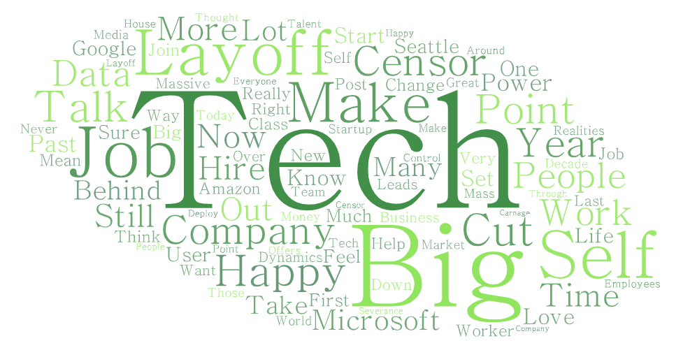
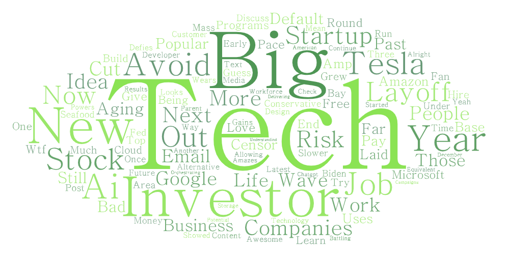
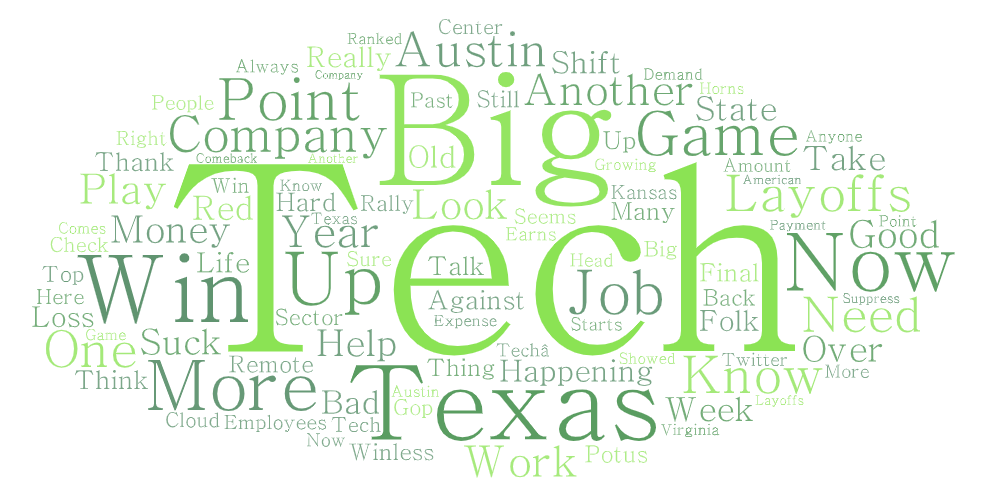

# Lab 2: Geo-tagged tweet collection and visualization

> Ayata Bernhardt GEOG 458

## Narrative

This project is focused on my interest on the issue regarding big tech industries and their mass layoff in the recent months. I took text from user tweets on Twitter, known to be one of the easiest platforms to freely discuss political and social issues. This topic interested me the most as it is related to my desired career, and Twitter is also a related topic in the big tech world due to Elon Musk's acquisition. I chose the three locations listed below, as Seattle is currently under a hiring freeze and recently had a layoff spree, Silicon Valley is a big center for startups (opposite of big tech), and Austin is a good medium that is more controlled and not biased towards much news. I retrieved data from three areas in the US that have a booming tech hub:

- Seattle, WA
- Silicon Valley, CA
- Austin, TX

Although the data collected may be similar, I thought it would be worthwhile seeing what people who live in tech-centered cities mention regarding the keyword: "big tech."

## Word Clouds for Each Area

### Seattle Wordcloud
[Link to Seattle Wordcloud](assets/twsearch-result-1.csv)

### Silicon Valley Wordcloud
[Link to Silicon Valley Wordcloud](assets/twsearch-result-2.csv)

### Austin Wordcloud
[Link to Austin Wordcloud](assets/twsearch-result-3.csv)

## Analysis of Wordclouds

I noticed that a large proportion of tweets in Seattle mention the word: "layoff," most likely in regards to the recent mass layoff that occurred in Amazon, Google, and Meta, and ironically, the word "Happy" was used in many tweets. This could be in junction with negative connotation in a tweet, but it was still amusing to see two words on opposite ends of the spectrum in terms of the mood of a word. Because I was not expecting to see very much of a difference in results, it is interesting and surprising to see that places that were affected by a recent big issue in the location actually mention a geographically-related keyword multiple times. Additionally, I included Silicon Valley to see what twitter users may be talking about in the most well known startup and tech district in the US, and it yielded results keywords such as "New," "Investor," and "Startup," which was expected from the environment of the location. Finally, Austin's wordcloud was treated like a control location, giving the results I was expecting because they did not have any big news or anything out of the ordinary.

My research was pretty broad, as I was trying to see if people tweeting about big tech companies in these locations would have a particular way of speaking or topic to tweet about. Next time, it could be worth getting three locations with similar environments in terms of its political and social climate to see if the wordclouds have any particular differences.